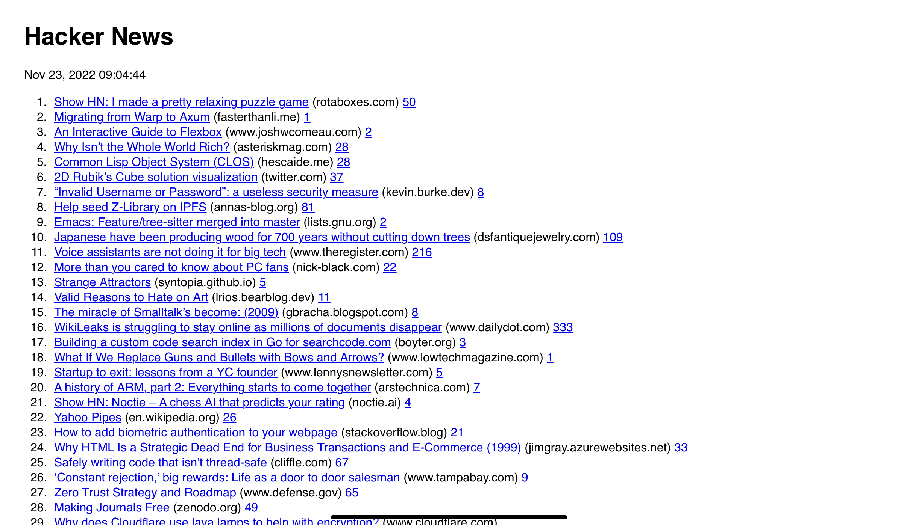

# Free Portfolio Website Templates

A collection of **100% FREE** to use portfolio website templates.

## ⚡ Features

✅ 
## 🎨 Templates

<h3><a href="https://uvacoder.github.io/simple-projects/simple-hn">HackerNews</a></h3>

<h3><a href="https://uvacoder.github.io/simple-projects/simple-birthday-site">Birthday Site</a></h3>

<h3><a href="https://uvacoder.github.io/simple-projects/simple-password-generator">Password Generator</a></h3>

  
<h3><a href="https://ossphilippines.github.io/freefolio/beginner">Beginner</a></h3>

<h3><a href="https://ossphilippines.github.io/freefolio/outlines">Outlines</a></h3>

<h3><a href="https://ossphilippines.github.io/freefolio/clean">Clean</a></h3>

<h3><a href="https://ossphilippines.github.io/freefolio/deepsea">Deep Sea</a></h3>

<h3><a href="https://ossphilippines.github.io/freefolio/simple">Simple</a></h3>

## 🎯 Contributing

Please read the project's [contributing guide](./CONTRIBUTING.md) for the process for submitting pull requests to us.

## 📋 Code of Conduct
This project and everyone participating in it are governed by the [Contributor Covenant Code of Conduct](./CODE_OF_CONDUCT.md). By participating, you agree to abide by this code of conduct.

## 📃 License

Freefolio is licensed under the MIT License - see the [LICENSE](LICENSE) file for details.

## 🤔 I am not a web developer, how do I setup my portfolio website?

Need help with setting up your portfolio website?

Contact us at https://ossph.org
